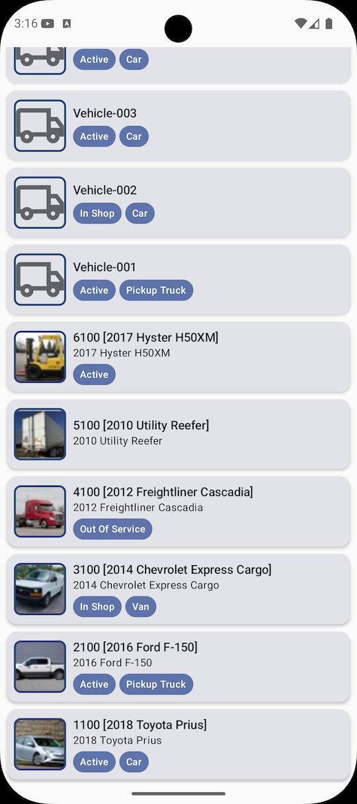
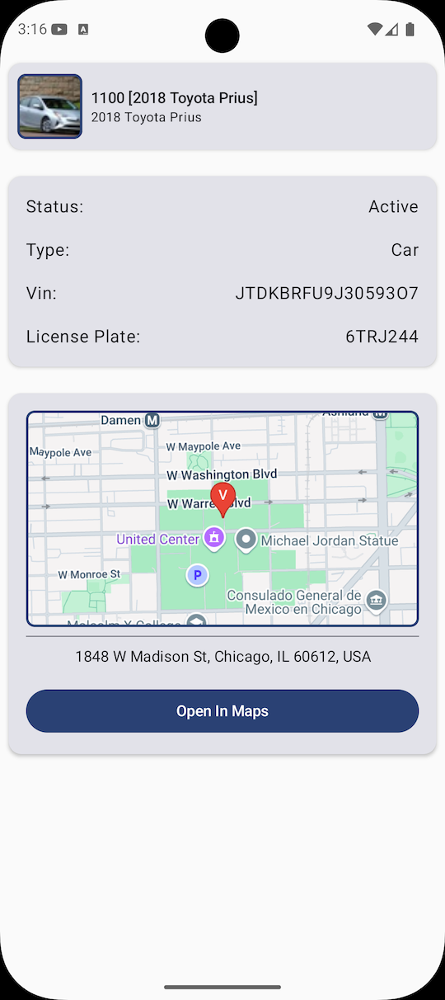

# Fleetio Assessment

**By Andrew Carmichael**

Thank you for the opportunity to complete the Fleet.io take-home interview.

---

## Screenshots

<table>
  <tr>
    <td align="center">
      <br>
      <em>List Screen</em>
    </td>
    <td align="center">
      <br>
      <em>Detail Screen</em>
    </td>
  </tr>
</table>

---

## Demo

Try the submission directly in your browser—no Android installation required!

[Launch Demo on Appetize.io](https://appetize.io/app/b_4jrcypyomazgbehiqudnwnjzom)

---

## Build Instructions

**Note:** API secrets are not committed to the GitHub repo. You will need to define these yourself in order to build the application.

### 1. Set Your API Secrets

Add the following lines to your `gradle.properties` file or set them as environment variables:

```properties
FLEETIO_ACCOUNT_TOKEN="secret"
FLEETIO_AUTHORIZATION_TOKEN="Token secret"
GOOGLE_MAPS_API_KEY="secret"
```

### 2. Use the correct developer tools

The application was build and tested only with:
- Android Studio Ladybug Feature Drop | 2024.2.2 Patch 1
- Tested with Pixel 9 API 35 emulator

---

## Notable details
- Application implemented following Google recommended Android architecture (clean architecture).
- Application is completely dependency injected using Koin.
- Both screens in the app have loading and error states.
- The list screen is implemented with paging, including loading more indication.
- The detail screen will display a map of the vehicle's last known location if defined. See the Toyota Prius in the demo.
- The user can navigate from the detail screen to a map application.
- UI @Previews exist for most of the UI.